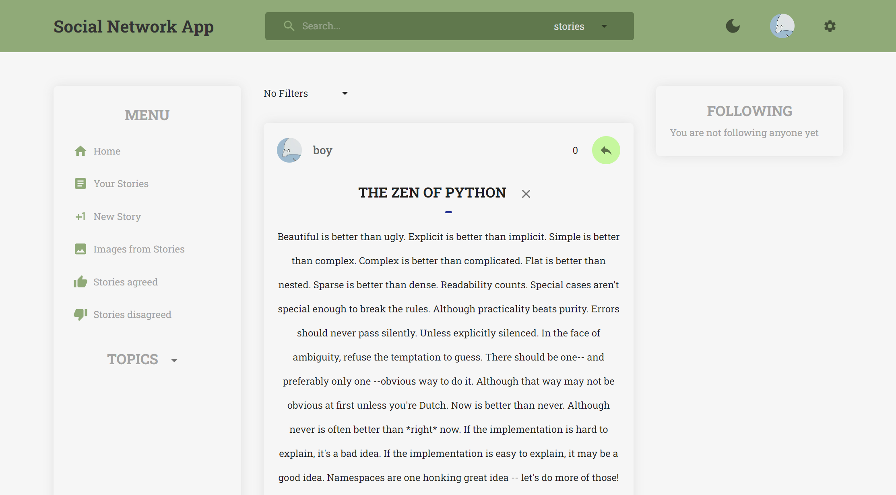
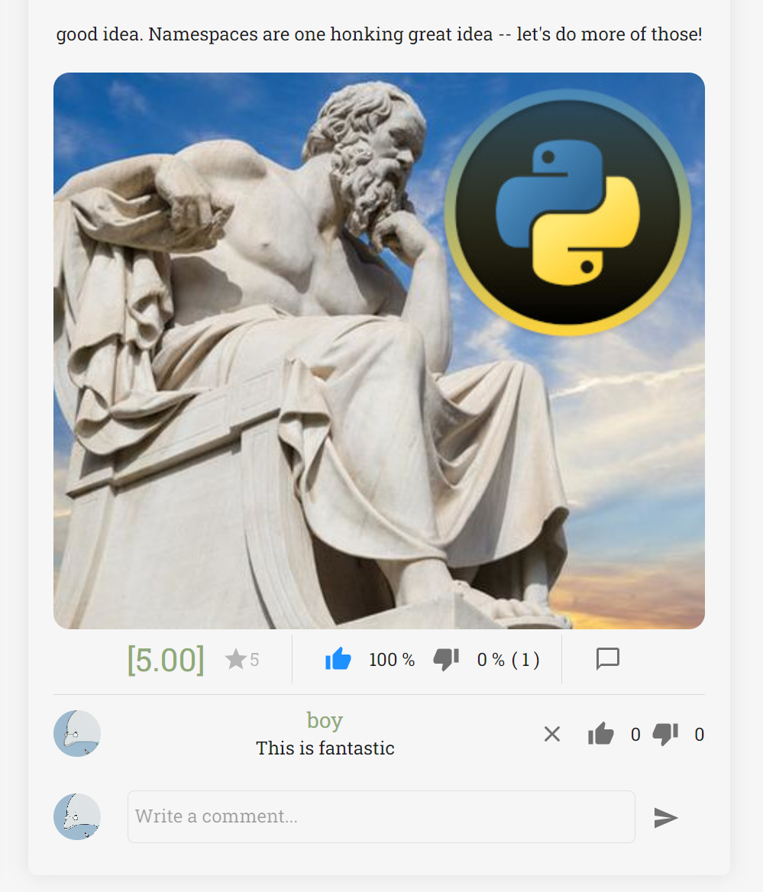

# Social Network App
## Description
This web application is a social network app that allows users  to connect, share thoughts and ideas by sharing posts (stories), which may contain images, users can create profiles, post stories, follow other users, and engage in discussion.

## Features
- **User Authentication**: Users can authenticate using a registration and logging system.
- **User Profiles**: Users can create and customize their profiles with option to registrate with pictures and joining groups.
- **Stories**: Equivalent to posts, users can type 100 words or more to share their ideas, and may add pictures, these can be commented, be agreed, or disagreed on, and rated from 1 to 5.
- **Follow System**: Users can follow other users, users can then receive a custom feed displaying their favorite users' posts.
## Technologies
- **Front-End**: React.js Redux Toolkit for state management, with MaterialUI for better UI managing.
- **Back-End**: Node.js with Express.js
- **Database**: MongoDB with Mongoose
- **Authentication**: JSON Web Tokens (JWT)
- **Styling**: UI designed with MaterialUI and Material-Icons
## Licence
This project is licenced under the MIT Licence.
